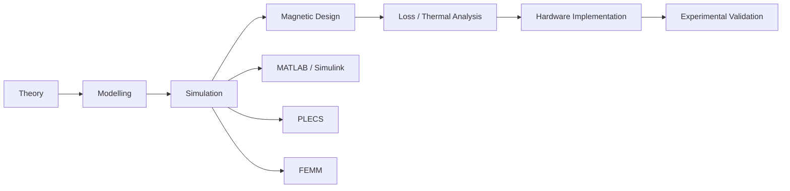
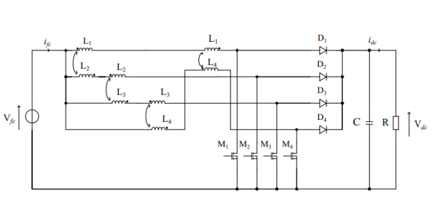
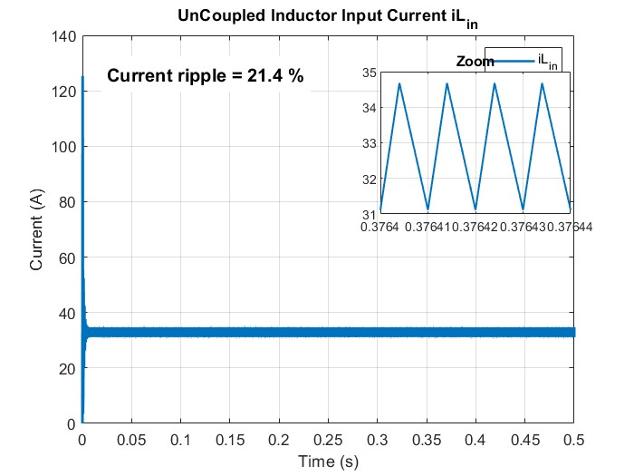
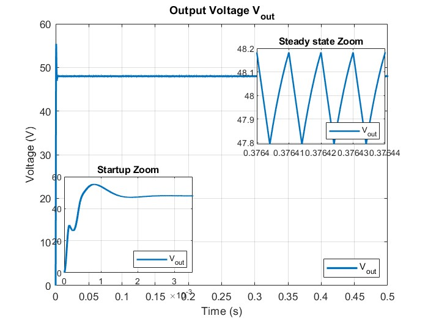
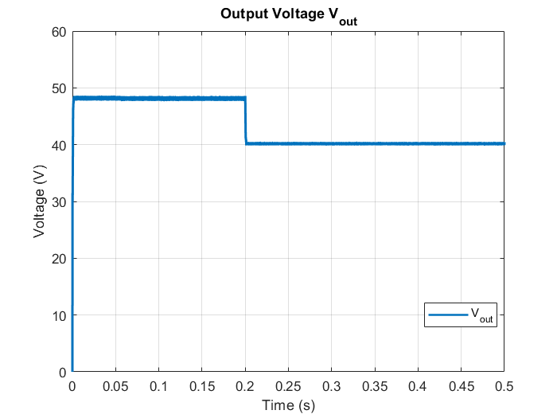
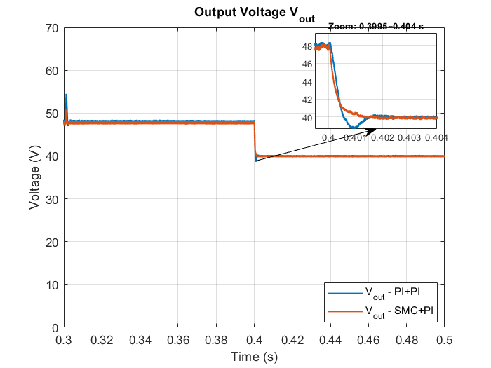
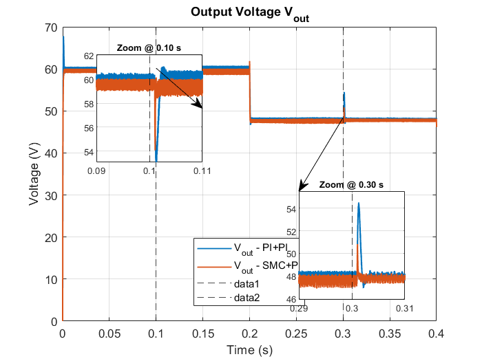

# Development of Direct and Inverse Coupled Inductors for a Four-Phase Interleaved Boost Converter (4PIBC) in Fuel Cell Vehicle Applications

This repository contains my master’s thesis:

> **“Development of Direct and Inverse Coupled Inductors for a Four-Phase Interleaved Boost Converter for Fuel Cell Vehicle Applications”**  
> Master’s Diploma Thesis, Erasmus Mundus E-PiCo+ (Electric Vehicle Propulsion and Control)  
> Conducted at **UTBM / FEMTO-ST Hydrogen Energy Platform (SHARPAC Team)**

<!-- ====================================================================== -->
<!-- Hero / system-level figure (replace with your own path)                -->
<!-- ====================================================================== -->


> FCEV powertrain diagram showing the PEM fuel cell stack, boost converter, and the traction inverter / DC bus.

---

## 1. Overview

Fuel Cell Electric Vehicles (FCEVs) require **high-efficiency DC-DC converters** to step up the low fuel-cell stack voltage to the higher DC bus levels used in the traction system. Conventional boost converters suffer from:

- High input current ripple  
- Large and bulky inductors  
- Limited efficiency and fault tolerance  

This work develops and validates **direct and inverse coupled inductors** integrated into a **four-phase interleaved boost converter (4PIBC)** to address these issues. The thesis combines:

- Analytical modeling (electrical + magnetic)
- Simulation in **MATLAB/Simulink** and **PLECS**
- Magnetic design and FEA in **FEMM**
- Hardware validation using **dSPACE DS1104** and a lab-scale converter test bench

The main motivation is to achieve **high efficiency**, **high power density**, and **low current ripple** for FCEV DC-DC conversion, while keeping the solution **compact and fault-tolerant**.

## Thesis Workflow



> The workflow
---

## 2. System Context: FCEV Powertrain

Fuel Cell Electric Vehicles (FCEVs) use a **PEM fuel cell (PEMFC)** stack as the primary energy source. The stack delivers relatively low DC voltage and high current, which must be boosted to a higher DC bus level for traction inverters.

Key challenges for the DC-DC stage:

- step-up conversion from low FC voltage to high DC bus,
- **very low input current ripple** to protect the fuel cell stack,
- compact magnetic components (reduced volume and weight),
- high efficiency and good thermal behaviour,
- fault tolerance and robustness under varying conditions.

Interleaved boost converters (IBCs), especially **four-phase** converters with coupled inductors, are well suited to fulfil these requirements by:

- sharing current across phases,
- reducing ripple via phase-shifting,
- and exploiting **magnetic coupling** for further ripple cancellation and downsizing.

<!-- Suggested figure -->


> Schematic of the 4-phase interleaved boost converter.

---

## 3. Key Contributions

- **Coupled inductor modeling**
  - Detailed **electrical and magnetic models** of direct and inverse coupled inductors.
  - Small-signal linearization and transfer-function derivation for control design of a **two-phase interleaved boost converter (2PIBC)** with inversely coupled inductors.

- **4-phase inverse-coupled topology (4PIBC-ICI)**
  - Design and analysis of a **cascade-cyclic 4-phase IBC** using inverse coupling.
  - Demonstrated **input current ripple reduction** from **21.4% (uncoupled)** to **1.6%**, i.e. about **92.5% ripple reduction**.

| Uncoupled Inductor (21.4% Ripple) | Inverse-Coupled Inductor (1.6% Ripple) |
| --------------------------------- | -------------------------------------- |
|  |  |

<!--
Replace:
  docs/fig_ripple_uncoupled.png
  docs/fig_ripple_inverse.png
with the actual paths/filenames of your graphs.
-->


- **Advanced control design**
  - Classical **PI controller** design based on small-signal models.
  - **Sliding Mode Control (SMC)** as an outer-loop voltage controller:
    - Overshoot reduced from **13% → 0.8%**
    - Settling time reduced from **2 ms → 0.8 ms**
    - Maintained **≈97% efficiency**
      
| Closed-loop output voltage (PI) | Closed-loop output voltage (SMC) |
| -------------------------------- | -------------------------------- |
|  |  |

| Zoom on settling time | Zoom on load change |
| --------------------- | ------------------- |
|  |  |

### PI vs SMC performance metrics

| Metric              | PI     | SMC              |
| ------------------- | ------ | ---------------- |
| Overshoot (load step) | 4.2%   | **0.8%**       |
| Recovery time       | 25 ms  | **8 ms**         |
| Settling time       | 2 ms   | **0.8 ms**       |
| SS voltage error    | 4.2 mV | **1.5 mV**       |

- **Magnetic design and optimization**
  - Systematic design methodology for **EE-type ferrite cores (3C92)**.
  - Optimized air-gap placement achieving **inverse coupling coefficient k ≈ −1/3**.
  - **Core volume reduction ~52%** when moving from 2-phase to 4-phase configuration, improving power density.

- **Loss & thermal analysis**
  - Analytical models for:
    - Conduction and switching losses in **SiC MOSFETs** and **SiC Schottky diodes**
    - Copper & core losses in the coupled inductors
  - Thermal evaluation confirming safe junction temperatures:
    - MOSFET ≈ **91 °C**
    - Diode ≈ **70 °C**
    - Both well below 175 °C device limits

- **Prototype and experimental validation**
  - Physical prototypes built with:
    - **E56/24/19** cores for 2PIBC
    - **E42/21/15** cores for 4PIBC
    - Custom twisted **Litz wire (20 × 0.5 mm)** to reduce HF losses
  - Experimental tests on a **buck converter test bench** under real switching conditions, controlled by **dSPACE DS1104**.
  - Measured inductance (~81.8 µH in buck mode) consistent with theoretical predictions and inverse coupling behaviour.
---

## 4. Converter Topologies and Specifications

### 4.1 Two-Phase Interleaved Boost Converter (2PIBC-ICI)

The design process starts from a **2-phase interleaved boost converter with inversely coupled inductors (2PIBC-ICI)**. This simpler structure is used to:

- understand coupling effects,
- validate control strategies,
- and derive design rules before extending to the 4-phase case. 

**Nominal specifications (2PIBC prototype)**   

| Parameter                     | Symbol | Value      |
|------------------------------|--------|-----------:|
| Input voltage (fuel cell)    | $V_\text{in}$  | 14.4 V    |
| Output voltage (DC bus)      | $V_\text{out}$ | 48 V      |
| Rated output power           | $P_\text{out}$ | 500 W     |
| Switching frequency          | $f_s$ | 50 kHz    |
| Max input current ripple     |        | ≈ 10 %    |
| Max output voltage ripple    |        | ≈ 1 %     |

**Active devices**

- SiC MOSFET: Wolfspeed **C3M0015065D**
- SiC Schottky diode: Wolfspeed **C6D20065D**

**Magnetic components (2PIBC-ICI)**   

- Core: EE-type **E56/24/19**, material **3C92**  
- Number of turns (per winding): 14  
- Target inductance (boost mode): ≈ 47–48 µH  
- Coupling coefficient: \(k \approx -\tfrac{1}{3}\) (inverse coupling)

<!-- Suggested figure -->


> _Placeholder suggestion:_ (a) 2PIBC-ICI electrical schematic. (b) Magnetic equivalent circuit / reluctance model for the EE core.

### 4.2 Four-Phase Interleaved Boost Converter (4PIBC-ICI)

Once the 2-phase prototype is validated, it is extended to a **cascade-cyclic 4-phase interleaved boost converter**:

- Four boost legs, each shifted by 90° in switching period.
- Cascade-cyclic magnetic connection: last inductor couples back to the first leg.
- Each phase processes ~25% of total power, reducing thermal and current stress. 

**Magnetic components (4PIBC-ICI)** :contentReference[oaicite:9]{index=9}  

- Core: EE-type **E42/21/15**, material **3C92**  
- Same coupling philosophy: \(k \approx -\tfrac{1}{3}\) via tailored air gaps.  
- Overall magnetic optimisation achieves about **52% reduction in total core volume** when going from 2-phase to 4-phase design, significantly improving power density.

<!-- Suggested figure -->


> _Placeholder suggestion:_ 4PIBC cascade-cyclic coupled inductors with phase labels, showing how each inductor pair links to the next phase.

---

## 5. Coupled Inductor Modelling and Magnetic Design

### 5.1 Electrical Model

For two coupled inductors with self-inductances \(L_1, L_2\) and mutual inductance \(M\):

\[
\begin{aligned}
v_1 &= L_1 \frac{di_1}{dt} \pm M \frac{di_2}{dt}, \\
v_2 &= L_2 \frac{di_2}{dt} \pm M \frac{di_1}{dt},
\end{aligned}
\]

where the sign depends on **direct** (reinforcing) or **inverse** (opposing) coupling. For symmetric windings \(L_1 = L_2 = L\) and \(M = kL\), with:

- \(k > 0\) for direct coupling,
- \(k < 0\) for inverse coupling. 

The model is integrated into PLECS for 2PIBC and then generalised to 4PIBC (multiple modes per switching period).

### 5.2 Magnetic Circuit Model

The EE-core is represented by a reluctance network:

- outer leg reluctances \(R_o\),
- central leg reluctance \(R_T\),
- air gaps on outer and central legs controlling magnetising and leakage flux. 

Flux distribution:

- In **inverse coupling**, winding currents are oriented so that their fluxes oppose in the central leg, aiding **flux cancellation** and **core downsizing**.
- The effective coupling factor \(k\) is tuned by **air-gap sizes and positions**.

### 5.3 Core Selection and Sizing

The design follows a step-by-step algorithm:

1. Specify electrical targets: \(V_\text{in}\), \(V_\text{out}\), \(P_\text{out}\), \(f_s\), ripple constraints.
2. Compute required inductance per phase in boost mode (taking inverse coupling into account).
3. Choose candidate EE cores (3C92) and evaluate:
   - effective cross-section \(A_e\),
   - magnetic path length \(l_e\),
   - area product,
   - saturation flux density limits.
4. Place and tune air gaps to achieve:
   - target inductance,
   - coupling factor around \(k \approx -\frac{1}{3}\),
   - acceptable flux density and losses. 

### 5.4 FEMM (FEA) Verification

Finite-element simulations (FEMM) are used to:

- check flux distribution and local saturation margins,
- visualise field lines for direct vs inverse coupling,
- cross-check inductance values and coupling factors from the analytical design.

<!-- Suggested figure -->


> _Placeholder suggestion:_ FEMM plot showing magnetic flux density distribution in the EE core for inverse coupling at nominal conditions.

---

## 6. Control Design: Dual-Loop PI and Sliding Mode Control

### 6.1 Dual-Loop PI Control for 2PIBC-ICI

A classical **dual-loop PI control** structure is implemented:

- **Outer voltage loop**
  - Regulates output voltage \(V_\text{out}\) to 48 V.
  - Generates reference inductor/phase current \(i_{L,\text{ref}}\).

- **Inner current loop**
  - Tracks \(i_{L,\text{ref}}\).
  - Generates duty cycle \(d\) for PWM.

The design uses small-signal modelling of the 2PIBC around a nominal operating point, extracting the control-to-output and current-to-duty transfer functions and tuning PI gains for:

- sufficient phase margin,
- desired bandwidth hierarchy (current loop faster than voltage loop). 

<!-- Suggested figure -->


> _Placeholder suggestion:_ Block diagram with plant, inner current loop PI, outer voltage loop PI, and PWM generator.

Simulation results show:

- DC bus regulated around 48 V,
- output voltage ripple around 0.8% under step load changes. :contentReference[oaicite:14]{index=14}

### 6.2 Sliding Mode Control (SMC) for Improved Dynamics

To enhance transient performance and robustness, a **Sliding Mode Controller (SMC)** is designed for the outer voltage loop (while keeping the fast inner current loop).

Key elements:

- Sliding surface defined based on voltage error and its integral.
- Control law switches the duty ratio around the sliding surface to enforce convergence.
- Parameters chosen to:
  - eliminate overshoot,
  - reduce settling time,
  - improve robustness against parameter variations (inductance, load, input voltage).

Main performance improvements (4PIBC with inverse coupling) relative to PI:   

- Input current ripple reduction from **21.4% (uncoupled)** to **1.6% (inverse coupled)**.
- Voltage overshoot reduced from **≈13%** (PI) to **≈0.8%** (SMC).
- Voltage settling time reduced from **≈2 ms** to **≈0.8 ms**.
- Overall efficiency maintained around **97%**.

<!-- Suggested figure -->


> _Placeholder suggestion:_ Overlay plot comparing PI and SMC responses for a load step: output voltage, inductor current, and duty cycle.

---

## 7. Loss and Thermal Modelling

A unified model is implemented for the **total loss** of an N-phase interleaved converter:   

\[
P_{\text{loss,total}} = N \left( P_\text{MOSFET} + P_\text{diode} + P_\text{inductor} \right)
\]

with:

- \(P_\text{MOSFET} = P_\text{cond,M} + P_\text{on,M} + P_\text{off,M} + P_\text{gate}\)
- \(P_\text{diode} = P_\text{cond,D} + P_\text{rr,D}\)
- \(P_\text{inductor} = P_\text{copper} + P_\text{core}\)

### 7.1 Semiconductor Losses

- Conduction losses derived from RMS currents and on-state characteristics.
- Switching losses evaluated using datasheet energy curves \(E_\text{on}, E_\text{off}, E_\text{rr}\) versus current and voltage.
- Gate-drive losses estimated from charge and switching frequency.

### 7.2 Inductor Copper & Core Losses

- DC and AC winding resistances considered (skin and proximity effects, Litz wire).
- Core losses modelled using an **Improved Steinmetz equation**:
  \[
  P_{\text{core,density}} = a \, B_\text{pk}^{\,b} f_s^{\,c},
  \]
  with material-dependent \(a, b, c\) for 3C92 ferrite. :contentReference[oaicite:17]{index=17}
- Flux density swing \(B_\text{pk}\) computed from inductor current ripple and core geometry.

### 7.3 Thermal Model

- Lumped **RC thermal network** from device junction to ambient.
- Thermal impedance used to estimate junction temperatures for worst-case power losses.
- Proper heat sink sizing ensures safe operation.

Representative result at ~500 W:   

- Analytical loss model: ≈ 17.6 W total loss → efficiency ≈ 97%.
- PLECS electro-thermal simulation: ≈ 13.84 W at ≈ 477 W output → similar efficiency.
- Peak junction temperatures:
  - MOSFET ≈ 91 °C,
  - diode ≈ 70 °C,
  - both well below their maximum ratings (≈ 175 °C).

<!-- Suggested figures -->
  


> _Placeholder suggestions:_  
> 1. Bar chart of loss breakdown (MOSFET, diode, inductor copper, core).  
> 2. Thermal network diagram plus junction temperature vs. time at nominal load.

---

## 8. Experimental Validation

### 8.1 2PIBC-ICI with dSPACE 1104

The initial plan is to validate the 2PIBC-ICI under **closed-loop control** with a **dSPACE 1104** real-time controller:

- Digital control implemented in Simulink + RTI.
- Slave Bit Outputs (SBO) used for PWM at moderate switching frequencies.
- Experimental setup includes:
  - DC source,
  - 2PIBC prototype with coupled inductors,
  - output filter and load,
  - current/voltage probes and oscilloscope,
  - ControlDesk interface. 

Practical limitations:

- SBO resolution and timing constraints limit reliable switching frequency to ~7.5 kHz, which is too low for the original 50 kHz design.
- The dedicated PWM Channels block can reach ~15 kHz but cannot easily generate 180° phase-shifted interleaved gating for two phases.

These limitations motivate an alternative validation strategy.

### 8.2 Buck Converter Test Bench for Inductor Validation

To experimentally validate the **magnetic design** despite the hardware constraints:

- The coupled inductor is integrated into an existing **single-phase buck converter** test bench controlled by dSPACE.
- Inductance is identified from measured waveforms (voltage and current) using the buck inductor equation:
  \[
  L_\text{buck} = \frac{(V_\text{in} - V_\text{out}) D}{f_s \Delta I_L}.
  \] :contentReference[oaicite:20]{index=20}
- The measured inductance (~81.8 µH in buck mode) closely matches the theoretical equivalent inductance when the device operates without ripple-cancelling interleaving, confirming:
  - correct core sizing,
  - expected inverse coupling behaviour,
  - suitability for the intended 2PIBC/4PIBC operation. 

<!-- Suggested figures -->
  


> _Placeholder suggestions:_  
> 1. Photo of the lab setup (converter, inductor, sensors, dSPACE rack).  
> 2. Oscilloscope plots of inductor voltage/current with annotations showing the slope used to extract inductance.

---

## 9. Key Contributions and Results

1. **Comprehensive Electrical & Magnetic Models**
   - Unified treatment of direct and inverse coupled inductors, including small-signal linearisation for control-oriented analysis.   

2. **Systematic Design Methodology for EE-Core Coupled Inductors**
   - Practical sizing workflow for 3C92 EE cores with air-gap tuning, custom Litz windings, and a target inverse coupling \(k \approx -\tfrac{1}{3}\).   

3. **Significant Current Ripple Reduction**
   - In cascade-cyclic 4PIBC with inverse coupling:
     - Input current ripple reduced from **≈21.4%** (uncoupled) to **≈1.6%** (inverse coupled), i.e., ~**92.5% reduction**. :contentReference[oaicite:24]{index=24}  

4. **Core Volume and Power Density Improvement**
   - Transition from 2-phase to 4-phase design with optimised coupled inductors yields about **52% reduction in total core volume**, enabling higher power density. :contentReference[oaicite:25]{index=25}  

5. **Enhanced Control Performance with SMC**
   - Sliding Mode Control for the outer voltage loop:
     - Overshoot reduced from ~13% to ~0.8%.
     - Settling time reduced from ~2 ms to ~0.8 ms.
     - Efficiency maintained at ~97%.   

6. **Validated Loss & Thermal Design**
   - Combined analytical and PLECS electro-thermal simulations demonstrate safe junction temperatures (≈91 °C for MOSFETs, ≈70 °C for diodes) under nominal power.   

7. **Experimental Validation of Magnetic Behaviour**
   - Buck test bench measurements confirm the designed inductance and inverse coupling, validating the magnetic design despite multiphase PWM hardware limitations.   

---

## 10. Repository Structure

> _Note:_ This is a suggested structure. Update paths/names to match your actual repository.

```text
.
├── README.md
├── docs/
│   ├── thesis-summary.pdf
│   ├── figures/
│   │   ├── fig_fcev_powertrain_4pibc.png
│   │   ├── fig_4pibc_topology.png
│   │   ├── fig_2pibc_ici_electrical_magnetic.png
│   │   ├── fig_femm_field_plot.png
│   │   ├── fig_pi_vs_smc_voltage_current.png
│   │   ├── fig_loss_breakdown_efficiency.png
│   │   ├── fig_thermal_network_temperatures.png
│   │   ├── fig_lab_testbench_photo.png
│   │   └── fig_inductor_measured_waveforms.png
│   └── slides/
│       └── defense_presentation.pdf
├── models/
│   ├── matlab/
│   │   ├── two_phase_ici_model.m
│   │   └── four_phase_ici_model.m
│   ├── simulink/
│   │   ├── 2pibc_ici.slx
│   │   └── 4pibc_ici.slx
│   └── plecs/
│       ├── 2pibc_ici.plecs
│       └── 4pibc_ici.plecs
├── magnetics/
│   ├── design_calculations/
│   │   ├── core_sizing_2pibc.xlsx
│   │   └── core_sizing_4pibc.xlsx
│   └── femm_models/
│       ├── 2pibc_ici.fem
│       └── 4pibc_ici.fem
├── control/
│   ├── pi_controller_design.m
│   ├── smc_controller_design.m
│   └── bode_plots/
├── losses_thermal/
│   ├── semiconductor_losses.m
│   ├── inductor_losses.m
│   └── thermal_model.plecs
└── experiments/
    ├── ds1104_2pibc/
    └── buck_testbench/
        ├── scripts/
        └── measurement_data/
